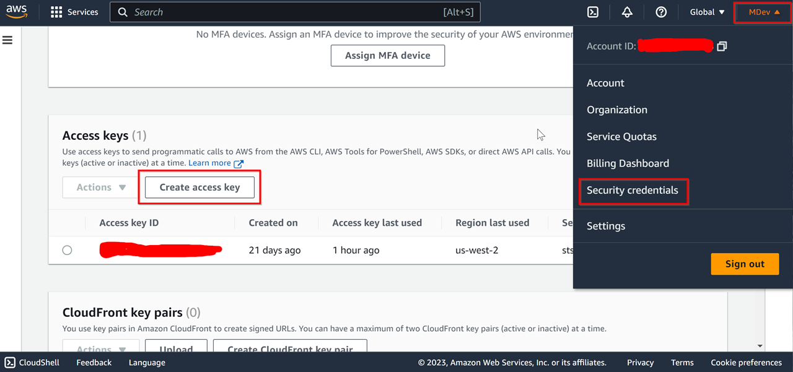
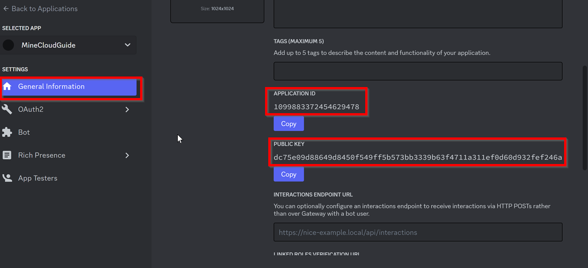
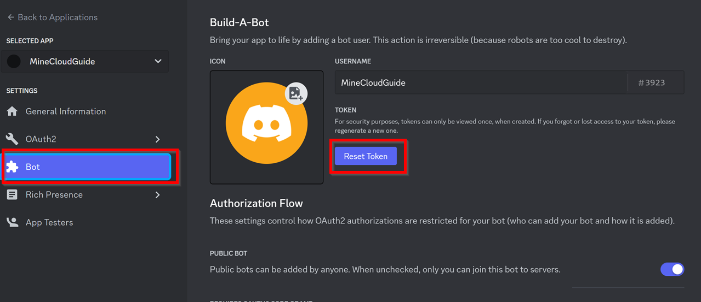
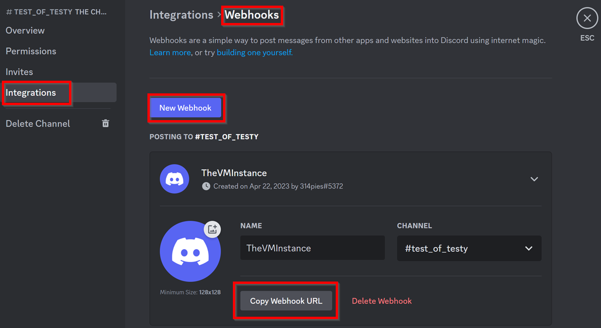
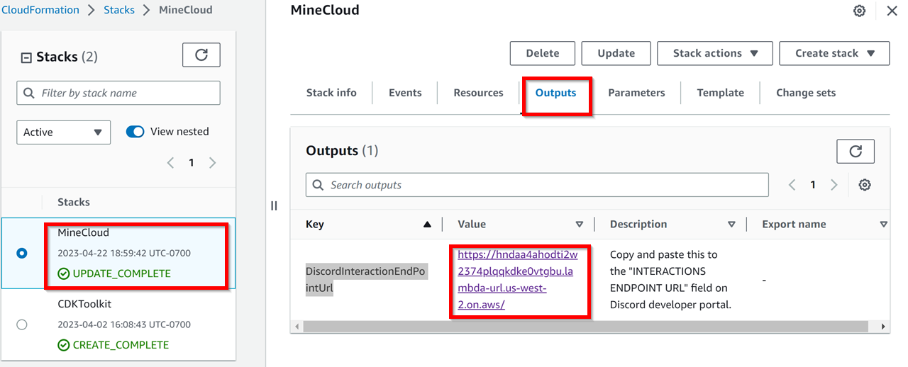
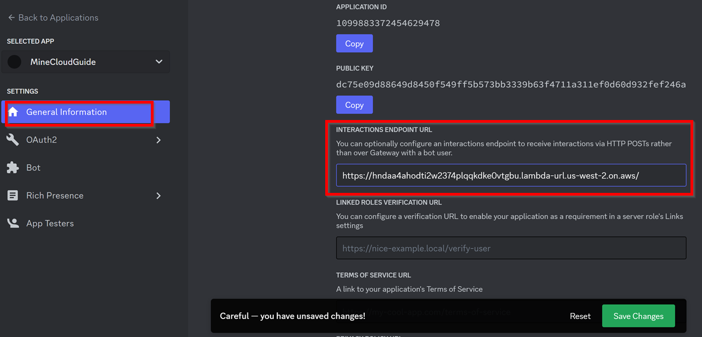
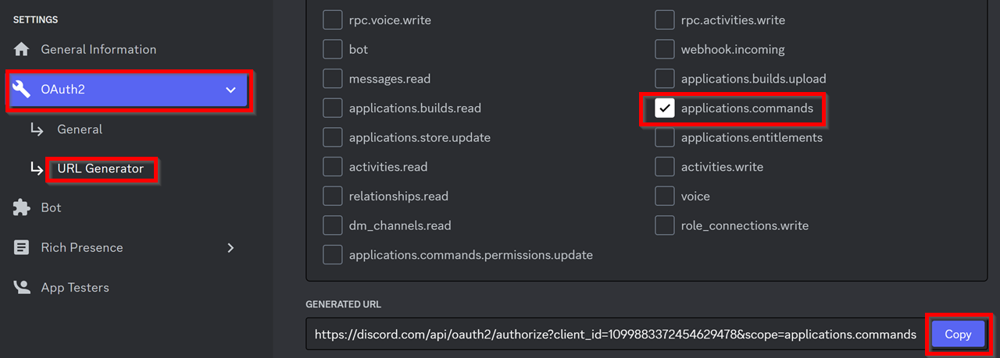
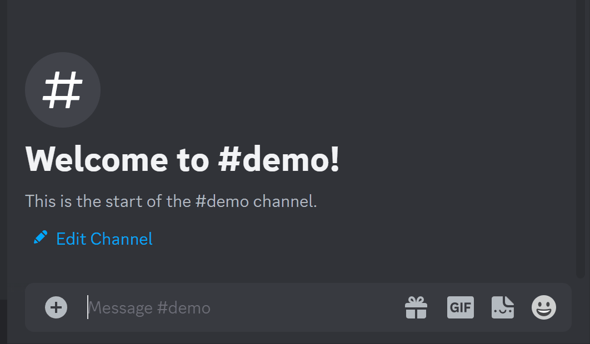

# MineCloud

[](https://github.com/VeriorPies/Minecloud/releases) [](https://github.com/VeriorPies/MineCloud/wiki) [](https://github.com/VeriorPies/MineCloud/blob/main/LICENSE) [](https://github.com/VeriorPies/MineCloud/pulls) [](https://discord.gg/fuTdbYrbZm)

MineCloud is an AWS CDK (Cloud Development Kit) project that allows you to 
set up your (almost) free on-demand Minecraft (or other multiplayer game) server for your Discord community with minimal time.

*(MineCloud came with Minecraft server built-in, but can be easily modified to host other multiplayer game servers as well. For more details, please refer to the [Terraria example](https://github.com/VeriorPies/MineCloud/tree/Terraria))*
<br>


<p align="center">
<b>Enjoy your hassle-free Minecraft server with your friends on Discord at almost no cost!
</b>
<br>
</p>

## Features

1. Discord Bot - start, stop, and backup the server with Discord commands (The server IP address will be sent to Discord channel after start)
2. Auto shutdown and backup when no one is online
3. Easy to setup - we do our best to make the process as simple as possible :)
4. Almost free (≈54 cents for 20 hr play/month - <ins>with a 2 CPUs & 8GB RAM server</ins>)
5. Fully customizable - install whatever mods you like
6. No maintenance cost - don't have time to play? Just leave it there! It cost nothing
7. Can be easily modified to host other multiplayer game servers as well

#### *Supported Discord Commands*

- `mc_start`: Start the server and send the IP address to Discord channel
- `mc_stop`: Stop the server
- `mc_restart`: Restart the server process
- `mc_backup`: Pause the server and create a backup
- `mc_backup_download`: Get the download link of the latest backup

#### *Cost Breakdown*

with _20 hrs_ play / month

- Lambda: Free tier
- S3: Free tier, unless total backup size exceeds 5GB (default max backup count is 3)
- Data Transfer: Free tier, unless total data transfer exceeds 100GB
- EC2: 0.27 (`t2.large` spot price) \* 20 (hr) ≈ $0.54/month
- **Total**: ≈ $0.54/month

Please refer to [Spot Instances Pricing](https://aws.amazon.com/ec2/spot/pricing/) and [S3 Pricing](https://aws.amazon.com/s3/pricing) for more information.

## How To Setup?

If you prefer, we have a step-by-step video tutorial ↓  
[](https://youtu.be/6L-cPb_IOX4)

### **Prerequisites**

1. A [Discord](https://discord.com/) account :)
2. Node.js 18 (or above) - If haven't, go to https://nodejs.org to download and install the latest version of Node.js
   - Type `node --version` in the terminal to confirm Node is properly set up. You should see something like this:
     ```
     v18.xx.x
     ```
3. An AWS account and AWS CLI
   - If haven't already, go to https://aws.amazon.com/ to register an AWS account
   - Download and install AWS CLI from [here](https://docs.aws.amazon.com/cli/latest/userguide/getting-started-install.html)
     - Type `aws --version` in the terminal to confirm AWS CLI is properly set up. Something like this should show up:
       ```
       aws-cli/2.10.0 Python/3.11.2 Windows/10 exe/AMD64 prompt/off
       ```
   - Setup AWS CLI credentials:
     - Login to your AWS account, click the account name at the top-right corner and click "Security credentials". Go to the "Access keys" section and create an access key. Notes down `Access key` and `Secret access key`  
       &nbsp;&nbsp;&nbsp; 
   - In the terminal, type:
     ```
     aws configure
     ```
     When prompted, enter the `Access key` and `Secret access key` you got from the last step (and optionally choose the "default AWS region" and "output format")
   - Once done, type `aws sts get-caller-identity` in the terminal to confirm the AWS CLI credentials are set up correctly. You should see something like this:
     ```
     {
       "UserId": "1234567890",
       "Account": "1234567890",
       "Arn": "arn:aws:iam::1234567890:xxx"
     }
     ```
   - Prerequisites done, now start the fun part :)

### **Set up MineCloud**

1. Download the latest release from the [release page](https://github.com/VeriorPies/Minecloud/releases), unzip it and open `minecloud_configs/MineCloud-Configs.ts`, there're some parameters we have to provide first:
   - `AWS_ACCOUNT_ID`: Click the account name at the top-right corner of your AWS console and copy the `Account ID`
   - `AWS_REGION`: Choose a [region](https://docs.aws.amazon.com/AWSEC2/latest/UserGuide/using-regions-availability-zones.html) that's closet to you. Some example value are: `us-west-2`, `ap-northeast-1` or `eu-west-3`
   - `DISCORD_APP_ID` and `DISCORD_PUBLIC_KEY`: Go to [Discord Developer Portal](https://discord.com/developers/applications) and click "New Application" to create a new Discord APP. On the "General Information" page, you will find the App Id and Public Key.  
     &nbsp;&nbsp;&nbsp; 
   - `DISCORD_BOT_TOKEN`: Go to the "Bot" page on the Discord Developer Portal, reset and copy the token
     - This is the Discord BOT that will handle our commands. If there's no BOT shown, click the "Add Bot" button to create a new BOT  
     &nbsp;&nbsp;&nbsp; 
        <p align="center">
        You can optionally setup your BOT avatar<br>
        </p>
   - `DISCORD_CHANNEL_WEB_HOOK`:
     - Open regular Discord, go to the Discord server you want to add MineCloud to, choose a text channel, and click "Edit Channel".
     - Go to "Integrations" => "Webhooks", click "New Webhook" to create a new Webhook then copy the Webhook URL.
     - This text channel is where our VM instance will send updates to
     &nbsp;&nbsp;&nbsp; 
     <p align="center">
     You can also optionally set up your BOT avatar here<br>
     </p>
2. Deploy MineCloud
   - In the MineCloud project directory, type `npm install` in the terminal to install all dependencies
   - (Optional) Replace `minecloud_configs/server/server.zip` with your favorite Minecraft version / Mods, the default Minecraft being downloaded is `1.19.4` (When packing the server executable, make sure the server.jar is at the root level of the zip file).  
     After replacing `server.zip`, set `DEPLOY_LOCAL_SERVER_EXECUTABLE = true` in the `minecloud_configs/MineCloud-Configs.ts`
   - Open the terminal in the MineCloud folder and enter `npx cdk list` to make sure the build pass. You should see the stack name being printed:
     ```
     MineCloud
     ```
   - Bootstrap your AWS account by running `npx cdk bootstrap aws://<AWS_ACCOUNT_ID>/<AWS_REGION>`
   - Before deploying, read through [MINECRAFT END USER LICENSE AGREEMENT](https://www.minecraft.net/en-us/eula) and make sure you agree to it
   - Enter `npx cdk deploy` to deploy the stack.
   - Sit back and relax, this will take like 5~10 minutes ☕.
     - When you see a "The server instance is ready" message shown up in the Discord channel, this means your Minecraft server is almost ready to connect :)
3. Setup BOT for your Discord server
   - After MineCloud is deployed, go to your AWS [CloudFormation page](https://console.aws.amazon.com/cloudformation) (make sure to select the right AWS region)
   - Click on "MineCloud" stack, go to "Outputs" and copy the value of "Discord Interaction End Point Url"  
     &nbsp;&nbsp;&nbsp; 
   - Go back to your [Discord Developer Portal](https://discord.com/developers/applications), select the APP created, and paste the URL into the "INTERACTIONS ENDPOINT URL" field.  
     &nbsp;&nbsp;&nbsp; 
   - Go to "OAuth2" => "URL Generator", select "application.commands" and click "Copy"  
     &nbsp;&nbsp;&nbsp; 
   - Open the copied URL (either in Discord or the browser) and add the BOT to your Discord server.
   - You are all set now - Type any command (ex: `/mc_restart`) in the Discord text channel to give it a try🎉!  
     &nbsp;&nbsp;&nbsp; 

### **_ONE MORE THING!!!_**

If you have deployed MineCloud more than once, **THERE MIGHT BE DANGLING SPOT INSTANCE REQUESTS THAT WILL CONSTANTLY CHARGE YOU. MAKE SURE TO CHECK YOUR [EC2 SPOT REQUESTS TAB](https://console.aws.amazon.com/ec2/home#SpotInstances:) AND CANCEL THE DANGLING SPOT REQUEST IF THERE'S ANY!!**

## How does it work?

For more details, please refer to the [wiki page](https://github.com/VeriorPies/MineCloud/wiki/How-does-MineCloud-work%3F)! 

## Discord Server
We have a [Discord Server](https://discord.gg/fuTdbYrbZm)

## Need Help?
Common questions and troubleshooting can be found in the [FAQs & Troubleshooting page](https://github.com/VeriorPies/MineCloud/wiki/FAQs-&-Troubleshooting).  
You can also [create a question post](https://github.com/VeriorPies/MineCloud/issues) or ask on [Discord](https://discord.gg/fuTdbYrbZm) if you like.

## Support this project
A star will be appreciated ;)
