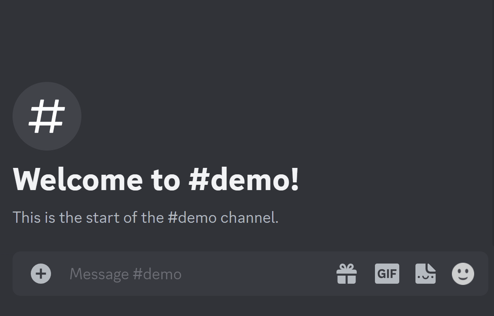

# MineCloud

[](https://github.com/VeriorPies/Minecloud/releases) [](https://github.com/VeriorPies/MineCloud/wiki) [](https://github.com/VeriorPies/MineCloud/blob/main/LICENSE) [](https://github.com/VeriorPies/MineCloud/pulls) [](https://discord.gg/fuTdbYrbZm)

MineCloud is a universal multiplayer server hosting solution based on AWS CDK (Cloud Development Kit) that allows users to set up an almost free on-demand game server for a Discord community in just a few minutes.  
*MineCloud support the following games out of the box:*  
- [*Minecraft*](/minecloud_configuration_packages/Minecraft/README.md)
- [*Terraria*](/minecloud_configuration_packages/Terraria/README.md)
- *more to add...*

*Don’t see your favorite game? Feel free to contribute to the list by following the [Create your own MineCloud Configuration Package](/minecloud_configuration_packages/CustomConfigurationPackageGuides.md) guides!*

<br>
<br>


<p align="center">
<b>Enjoy your hassle-free server with your friends on Discord at almost no cost!
</b>
<br>
</p>

## Features

1. Discord Bot - start, stop, and backup the server with Discord commands (The server IP address will be sent to the Discord channel after start)
2. Auto shutdown and backup when no one is online
3. Support varieties of games out of the Box 
4. Easy to setup - we do our best to make the process as simple as possible :)
5. Almost free (≈60 cents for 20 hr play/month - <ins>with a 2 CPUs & 8GB RAM server</ins>)
6. Fully customizable - install whatever mods you like
7. No maintenance cost - don't have time to play? Just leave it there! It cost nothing
8. Easily add support to more games using [Configuration Packages](/minecloud_configuration_packages/CustomConfigurationPackageGuides.md) 

#### *Supported Discord Commands*

- `mc_start`: Start the server and send the IP address to the Discord channel
- `mc_stop`: Stop the server
- `mc_restart`: Restart the server process
- `mc_backup`: Pause the server and create a backup
- `mc_backup_download`: Get the download link of the latest backup

#### *Cost Breakdown*

with _20 hrs_ play / month

- Lambda: Free tier
- S3: 5GB free tier for first 12 months, $0.03/GB after that (default max backup count is 3)
- Data Transfer: Free tier, unless total data transfer exceeds 100GB
- EC2: 0.27 (`t2.large` spot price) \* 20 (hr) ≈ $0.54/month
- **Total**: ≈ $0.60/month

Please refer to [Spot Instances Pricing](https://aws.amazon.com/ec2/spot/pricing/) and [S3 Pricing](https://aws.amazon.com/s3/pricing) for more information.

## Diagram

*For more details, please check out the [wiki page](https://github.com/VeriorPies/MineCloud/wiki/How-does-MineCloud-work%3F).* 

## How To Setup?

If you prefer, we have a step-by-step video tutorial ↓  
[](https://youtu.be/yb0sz8D385g)

### **Prerequisites**

1. A [Discord](https://discord.com/) account :)
2. Node.js 18 (or above) - If haven't, go to https://nodejs.org to download and install the latest version of Node.js
   - Type `node --version` in the terminal to confirm Node is properly set up. You should see something like this:
     ```
     v18.xx.x
     ```
3. An AWS account and AWS CLI
   - If haven't already, go to https://aws.amazon.com/ to register an AWS account
   - Download and install AWS CLI from [here](https://docs.aws.amazon.com/cli/latest/userguide/getting-started-install.html)
     - Type `aws --version` in the terminal to confirm AWS CLI is properly set up. Something like this should show up:
       ```
       aws-cli/2.10.0 Python/3.11.2 Windows/10 exe/AMD64 prompt/off
       ```
   - Setup AWS CLI credentials:
     - Login to your AWS account, click the account name at the top-right corner and click "Security credentials". Go to the "Access keys" section and create an access key. Notes down `Access key` and `Secret access key`  
       &nbsp;&nbsp;&nbsp; 
   - In the terminal, type:
     ```
     aws configure
     ```
     When prompted, enter the `Access key` and `Secret access key` you got from the last step (and optionally choose the "default AWS region" and "output format")
   - Once done, type `aws sts get-caller-identity` in the terminal to confirm the AWS CLI credentials are set up correctly. Something like this should show up:
     ```
     {
       "UserId": "1234567890",
       "Account": "1234567890",
       "Arn": "arn:aws:iam::1234567890:xxx"
     }
     ```
   - Prerequisites done, now start the fun part :)

### **Set up MineCloud**

1. Download a [Configuration Package](minecloud_configuration_packages/RELEASES.md) for your target game.  
2. Download and unzip the corresponding MineCloud version from the [MineCloud release page](https://github.com/VeriorPies/Minecloud/releases)
   -  Corresponding MineCloud versions are listed on the [Configuration Packages download page](minecloud_configuration_packages/RELEASES.md) OR can be found at the first line of the `MineCloud-Configs.ts` file in the configuration package.
3. Unzip the configuration package (ex: `"1.19.4 Vanilla.zip"`) into the `minecloud_configs` folder in the MineCloud project folder. The folders hierarchy should now look like this:  
      ```
      - /MineCloud_root_folder
        - /minecloud_configs <= Unzip the configuration package inside this
          - MineCloud-Configs.ts
          - /server
            - ...
          - /advanced_configs
            - ...
        - /bin
        - /lambda
        - /lib
        - /server_init_assets
        - ...
      ```
4. Open `minecloud_configs/MineCloud-Configs.ts`, there're some parameters we have to provide first:
   - `AWS_ACCOUNT_ID`: Click the account name at the top-right corner of your AWS console and copy the `Account ID`
   - `AWS_REGION`: Choose a [region](https://docs.aws.amazon.com/AWSEC2/latest/UserGuide/using-regions-availability-zones.html) that's closet to you. Some example values are: `us-west-2`, `ap-northeast-1` or `eu-west-2`
   - `DISCORD_APP_ID` and `DISCORD_PUBLIC_KEY`: Go to [Discord Developer Portal](https://discord.com/developers/applications) and click "New Application" to create a new Discord APP. On the "General Information" page, you will find the App Id and Public Key.  
     &nbsp;&nbsp;&nbsp; 
   - `DISCORD_BOT_TOKEN`: Go to the "Bot" page on the Discord Developer Portal, reset and copy the token
     - This is the Discord BOT that will handle our commands. If there's no BOT shown, click the "Add Bot" button to create a new BOT  
     &nbsp;&nbsp;&nbsp; 
        <p align="center">
        You can optionally setup the BOT avatar<br>
        </p>
   - `DISCORD_CHANNEL_WEB_HOOK`:
     - Open regular Discord, go to the Discord server you want to add MineCloud to, choose a text channel, and click "Edit Channel".
     - Go to "Integrations" => "Webhooks", click "New Webhook" to create a new Webhook then copy the Webhook URL.
     - This text channel is where our VM server instance will send updates to
     &nbsp;&nbsp;&nbsp; 
     <p align="center">
     You can also optionally set up the BOT avatar here<br>
     </p>
2. Deploy MineCloud
   - In the MineCloud project directory, type `npm install` in the terminal to install all the dependencies
   - (Optional) Follow the "Customize Deployment" section on the [Configuration Package's home page](minecloud_configuration_packages/RELEASES.md)
   - Open the terminal in the MineCloud folder and enter `npx cdk list` to make sure the build pass. You should see the stack name being printed:
     ```
     <Stack Name>
     ```
   - Bootstrap your AWS account by running `npx cdk bootstrap aws://<AWS_ACCOUNT_ID>/<AWS_REGION>`
   - Before deploying, read through the End User License Agreement for the game (ex: [Minecraft EULA](https://www.minecraft.net/en-us/eula)) and make sure you agree to it
   - Enter `npx cdk deploy` to deploy the stack.
   - Sit back and relax, this will take like 5~10 minutes ☕.
     - When you see a "The server instance is ready" message shown up in the Discord channel, this means your Minecraft server is almost ready to connect :)
3. Setup BOT for your Discord server
   - After MineCloud is deployed, go to your AWS [CloudFormation page](https://console.aws.amazon.com/cloudformation) (make sure to select the right AWS region)
   - Click on the "MineCloud" stack, go to "Outputs" and copy the value of "Discord Interaction End Point Url"  
     &nbsp;&nbsp;&nbsp; 
   - Go back to your [Discord Developer Portal](https://discord.com/developers/applications), select the APP created, and paste the URL into the "INTERACTIONS ENDPOINT URL" field.  
     &nbsp;&nbsp;&nbsp; 
   - Go to "OAuth2" => "URL Generator", select "application.commands" and click "Copy"  
     &nbsp;&nbsp;&nbsp; 
   - Open the copied URL (either in Discord or the browser) and add the BOT to your Discord server.
   - You are all set now - Type any command (ex: `/mc_restart`) in the Discord text channel to give it a try🎉!  
     &nbsp;&nbsp;&nbsp; 

### **_ONE MORE THING!!!_**

If you have deployed MineCloud more than once, **THERE MIGHT BE DANGLING SPOT INSTANCE REQUESTS THAT WILL CONSTANTLY CHARGE YOU. MAKE SURE TO CHECK YOUR [EC2 SPOT REQUESTS TAB](https://console.aws.amazon.com/ec2/home#SpotInstances:) AND CANCEL THE DANGLING SPOT REQUEST IF THERE'S ANY!!**


## Managing the Server after Deployment
After Deployment, the server can be managed by SSH terminal and SFTP clients.  
MineCloud's working directory is  `/opt/minecloud` and the game server folder is located at `/opt/minecloud/server`.  
Different Configuration Packages may have different file-saving locations, please refer to the Configuration Package's homepage for more details.  

### Access the Server Terminal
The server can be connected via SSH, the easiest way to do it is by using the "Connect" button at the top-right of the EC2 instance page on the AWS console.   
For useful commands, please checkout the [Useful Linux Commands](https://github.com/VeriorPies/MineCloud/wiki/FAQs-&-Troubleshooting#useful-linux-commands) section on the Wiki.   


### Interact With the Game Server
The game server is running in a [Screen](https://www.gnu.org/software/screen/) session. To interact with the game server:  
- Type `sudo screen -ls` to list out the screen session, and type `sudo screen -r` to enter the session 
- When done, use `Ctrl-a Ctrl-d` to exit the session.

### Manually Start/Stop the Game Server
To manually start/stop the game server:  
 - Pause the MineCloud service first: `sudo systemctl stop minecloud.service`
 - Go to the server directory with: `cd /opt/minecloud/server`, 
 - Manually start the game server: `sudo ./start_server.sh` 
 - Manually stop the game server: `sudo ./stop_server.sh`
 - Once done, Resume the MineCloud service: `sudo systemctl start minecloud.service`

 Usually, we will want to do this to make sure the server can start up correctly after we've made changes to the server files.  
 As long as `./start_server.sh` and `./start_server.sh` function properly, MineCloud service can start/stop the game server on the VM start and stop.  


### Managing Server Files
To make changes to the server files, connect to your EC2 instance with an SFTP client (ex: WinSCP).  

#### Step-by-Step Guide for Windows:  
- Download and install [WinSCP](https://winscp.net/eng/index.php)
- Install [PuTTY](https://www.putty.org/) (which should come with `PuTTY Key Generator`)
- Setup key pair:  
    - Open `PuTTY Key Generator` and click "Generate". When done, you should see your public key in the "Public key for pasting into OpenSSH authorized_keys" field
    - Turn on your EC2 instance, connect to the instance terminal via the AWS web console
    - Type `sudo nano .ssh/authorized_keys` to edit. Copy and paste in the public key from the "Public key for pasting into OpenSSH authorized_keys" field as a new line and `ctrl+x` to save the file.  
    - In `PuTTY Key Generator`, click "Save private key" to save your private key.
    - Your key pair is ready now!
- Connect to your machine with WinSCP to edit the server files
    - Before connecting, you will want to change the files owner first. To do so:  
        - In the EC2 terminal launched in previous steps. Run `sudo su` to become root user, and run `chown -R ec2-user:ec2-user /opt/minecloud/server` to change the owner of the server files to our WinSCP login user.
        - This is a workaround for our current user permission setup. We will further address this in future releases.  
    - In the EC2 terminal, run `sudo systemctl stop minecloud.service` to pause the MineCloud system service
    - Open WinSCP, paste in the server IP, click "Advanced" => "SSH/Authentication" and select the private key.  
    - Save and click "Login" to connect. Input "ec2-user" for the user name when prompted.   
    - You are all set now! Navigate to `/opt/minecloud/server` and start editing the server and world files.  
    - When done,  run `sudo /opt/minecloud/server/start_server` to make sure the server can start properly and run `sudo systemctl start minecloud.service` to enable the MineCloud system service again.  

## Deploy Multiple Game Servers
- We can have multiple MineCloud game servers for a Discord server (ex: 1 Minecraft server and 1 Terraria server) 
- Every game server needs to have its own Discord Bot and CloudFormation stack name. CloudFormation Stack name can be set via the `STACK_NAME` field in `minecloud_configs/MineCloud-Configs.ts`. 
- We can also have 2 versions of the same game (ex: Minecraft Vanilla 1.19.4 and Minecraft Forge server 1.19.3) as long as they have different Stack names.

## Need Help?
Common questions and troubleshooting can be found in the [FAQs & Troubleshooting page](https://github.com/VeriorPies/MineCloud/wiki/FAQs-&-Troubleshooting).  
You can also [create a question post](https://github.com/VeriorPies/MineCloud/issues) or ask on [Discord](https://discord.gg/fuTdbYrbZm) if you like.

## Support this project
A star will be appreciated ;)  
Also, please don't hesitate to contribute to the project if you have any good ideas!

## Discord Server
=> Join our [Discord Server](https://discord.gg/fuTdbYrbZm) <=
